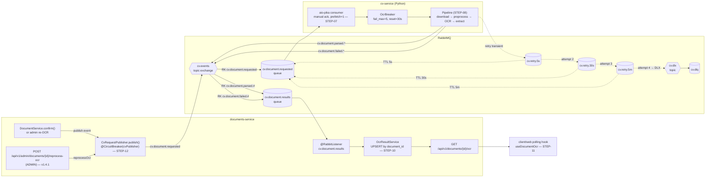

# FLOW-07: OCR/CV pipeline через RabbitMQ

#### Purpose / Context
Витяг реквізитів без блокування UI.
* * *
#### Actors
Core/OCR Orchestrator, CV-Service, RabbitMQ, MinIO.
* * *
#### Trigger
Новий документ типу паспорт/ІПН або вимога оператора.
* * *
#### Preconditions
Документ у S3; CV-модель активна.
* * *
#### Main Flow / Sequence
1. Core → `cv.events:` `cv.document.requested` `{s3Key, type, traceId}`
2. CV качає файл з S3, робить pre-proccessing та OCR.
3. CV → `cv.document.parsed` `{documentId, fields, confidence}`
4. Core зберігає `ocr_results`, пропонує автозаповнення, ставить прапор `auto-extracted`
* * *
#### Alternatives
*   A1: Низький `confidence` → route на ручну перевірку.
* * *
#### Errors / Retry
*   `cv.document.failed` з `retriable=true` → повтор 3 рази (5s/30s/5m), далі DLQ.

* * *

## Implementation as of v1.4.0 (CV-Service initial release)

The FLOW-07 pipeline shipped via STEP-01..14. The core protocol matches the spec above; the deltas captured here are operational details a future contributor needs.

### Topology



Operationally equivalent ASCII summary (kept for terminal readers):

```
documents-service.confirm() ── @CircuitBreaker(cvPublisher) ──► cv.events ── cv.document.requested ──► cv-service
                                       (STEP-12)                  exchange         queue                    │
admin re-OCR (v1.4.1) ─────────────────────────────────┘                                                    │
                                                                                                            ▼
                                                                                              OcrBreaker → PaddleOCR
                                                                                                            │
                          ┌────────── cv.document.parsed.* / .failed.* ──────────────────────┘  (cv.retry.5s/30s/5m → DLX)
                          ▼
              cv.document.results queue ── @RabbitListener ──► OcrResultService UPSERT (STEP-10)
                                                                       │
                                                                       ▼
                                                          GET /api/v1/documents/{id}/ocr ── client/web (STEP-11)
```

### Key contracts (binding)

* **`cv.document.requested`** — `{documentId, s3Key, documentType ∈ {passport, ipn, foreign_passport}, traceId}`. `traceId` is a 32-char hex UUID; the OTel span context travels via the AMQP `traceparent` header.
* **`cv.document.parsed`** — `{documentId, fields: Map<String,String>, confidence: BigDecimal[0,1], traceId}`.
* **`cv.document.failed`** — `{documentId, errorReason, retriable: boolean, traceId}`.
* **`OcrResultDto`** (REST, returned by `GET /api/v1/documents/{id}/ocr`) mirrors `cv.document.parsed` field-by-field. Null fields are omitted via `@JsonInclude(NON_NULL)` so a PENDING row is unambiguous on the wire.
* **`OcrResultStatus`** — `PENDING` / `PARSED` / `FAILED`. The client also has a derived `UNAVAILABLE` state after 60s of polling without a terminal status — UX-only, never persisted.

### Resilience

* **documents-service** wraps `CvRequestPublisher.publish` in a Resilience4j circuit breaker (`record-exceptions = [AmqpException, ConnectException, TimeoutException]`, sliding-window 10, failure-rate 50%, wait-in-open 30s). Fallback logs + increments `cv.publish.skipped` and swallows — `DocumentService.confirm` never surfaces broker exceptions to the caller.
* **cv-service** consumer acks AFTER the handler completes (manual ack, prefetch=1 task-per-delivery), so a kill mid-handler causes the broker to redeliver. The `IdempotencyCache` on `(documentId, s3Key)` collapses redelivered messages onto a single result.
* **frontend** — `useDocumentOcr` polls every 2s while PENDING; flips to `UNAVAILABLE` after 60s of continuous PENDING with a muted hint, no error toast, form remains submittable.

### Deviations from the original spec

* **Per-instance LRU dedup** instead of global. The product target (50 docs/min/instance) doesn't justify Redis-backed dedup yet; documented in `cv-service/CLAUDE.md` as a deferred migration.
* **`cv.events` is a topic exchange** (not the spec's bare queue) — necessary so documents-service's parsed/failed listener can bind on routing keys.
* **Operator personal-files page** is NOT where OCR is surfaced for review — STEP-11 wired the readOnly OCR card into `/operator/applications/[id]` (the actual review page with per-document detail) instead. The personal-files page remains a list of accepted apps without document previews.
* **Re-OCR for an existing document** is admin-only via `POST /api/v1/admin/documents/{id}/reprocess-ocr` (added in **v1.4.1**, ADMIN authority required, returns 202 PENDING / 404 / 409 not-CV-eligible). The legacy manual `rabbitmqadmin publish` recipe in `docs/runbooks/cv-service.md` is retained as the fallback when documents-service itself is unhealthy.

### SLO + load validation

50 docs/min/instance, queue lag < 60 messages, p95 < 5s, DLQ depth = 0 on clean fixtures, HTTP failure rate < 2%. Enforced empirically by the nightly `cv-load-test.yml` workflow (k6 ramping-arrival-rate 10→60 rpm sustained 5 min) and by per-stage pytest-benchmark budgets (download 0.5s / preprocess 0.7s / OCR 2.5s / extract 0.05s). Realistic timing on the synthetic fixture pool puts every stage well under budget; the budgets exist to catch algorithmic regressions before the end-to-end SLO does.
* * *
#### State & Data
`ocr_results.status`, DLQ записи, S3 оригінал.
* * *
#### Security / Compliance
*   Тільки лінки на S3; без персональних даних у payload черг.
#### Observability & SLO
Throughput ≥ 50 док/хв/instance; lag черги < 1 хв у піки.